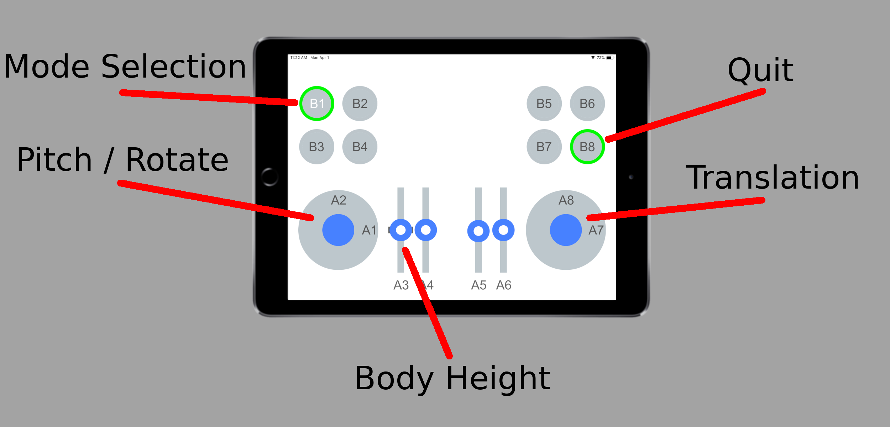

# Install

To install, you will first need to install the dependencies

1. [Install ROS](http://wiki.ros.org/melodic/Installation/Ubuntu) (we recommend ROS Melodic on Ubuntu 18.04)
1. Install the `hebi_cpp_api` ROS package:
`$ sudo apt install ros-melodic-hebi-cpp-api`

Now, checkout the code into a new ROS workspace:

```
$ cd ~
$ mkdir -p daisy_workspace/src
$ cd daisy_workspace/src
$ git clone https://github.com/HebiRobotics/hebi-ros-daisy
$ cd ../..
```

Finally, compile and install:

```
$ cd ~/daisy_workspace
$ catkin_make
$ catkin_make install
```

# Running

To launch the program, run the `daisy.launch` file in the `hebi-ros-daisy` package.

The robot will move into a starting stance position.  If one or more of the robot's legs do not move, check that the LEDs are not blinking yellow on any leg; this indicates that the leg is outside of a safe starting range, and should be moved back into range before continuing (e.g., by pulling up Scope and querying the current position).

The launch file also runs a "Controller" interface node that begins to search for a [Mobile IO app](http://docs.hebi.us/tools.html#mobile-io) on the network, with family "HEBI" and name "Mobile IO".  Once this is found, the Mobile IO interface will be configured for controlling Daisy.  This Mobile IO app should be connected to the robot's wireless network (default PW is `hebi1234`).

On the controller, you can use the following controls:

* B1: toggle stance mode (on) or step mode (off)
* B8: quit
* A1/A2: rotate (pitch forward/back only works in "stance" mode
* A3: move up/down
* A7/A8: shift position in x/y



You can also use ROS messages to control the hexapod:

* Velocity Commands
  * Channel: `/velocity_command`
  * Message: `geometry_msgs::Twist`
  * Purpose: linear and angular velocity commands

* Stance/Step toggle
  * Channel: `/mode_select`
  * Message: `std_msgs::Bool`
  * Purpose: "true" to enter stance mode, "false" to enter step mode.

# Configuring Auto-start

You can set up the code to run automatically at bootup.  This is done with the [`robot_upstart` ROS package](http://docs.ros.org/melodic/api/robot_upstart/html).

First, install the `robot_upstart` ROS package:

```
$ sudo apt install ros-melodic-robot-upstart
```

Then set up the script to run the `daisy` launch file at bootup:

```
$ cd ~/daisy_workspace
$ source devel/setup.sh
$ rosrun robot_upstart install hebi-ros-daisy/launch/daisy.launch
```

(To uninstall this startup script later, you can call call `rosrun robot_upstart uninstall hebi-ros-daisy`)

We have found that for this to work on bootup on ROS Melodic on Ubuntu 18.04, you will need to apply [this patch](
https://github.com/clearpathrobotics/robot_upstart/issues/71 )

In particular, open `/lib/systemd/system/hebi-ros-daisy.service` (you will need root access), and add the following lines to the first section:
```
After=network.target
Wants=network.target
After=network-online.target
Wants=network-online.target
```

Then run the following:
```
$ sudo systemctl enable NetworkManager-wait-online.service
$ sudo systemctl enable systemd-networkd-wait-online.service
```

You can start/stop this manually by calling:
```
$ sudo service hebi-ros-daisy start
$ sudo service hebi-ros-daisy stop
```

To debug, we found it is best to use `journalctl` (the instructions on the `robot_upstart` documentation are outdated):

```
$ sudo journalctl | hebi-ros-daisy
```

